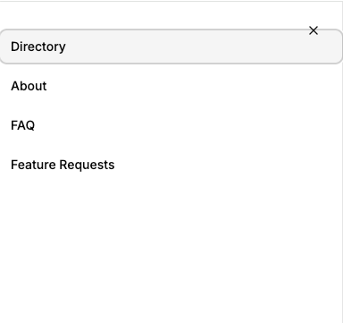
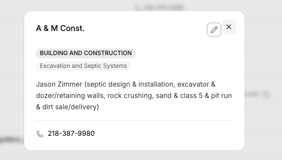

# TODO

- [ ] Fix sidenav layout, the close icon overlaps the hover of the menu items 
- [ ] Add github link and note that this is an open source project and accepts contributions (refer to contributors section of project README)
- [ ] Alert user or show tooltip when they upvote a feature request, they need to be logged in
- [ ] Fix the X and edit icon on the edit business profile view, they are out of alignment 
- [ ] Install http://quilljs.com/ with pnpm and use it to create a rich text editor for the business description 